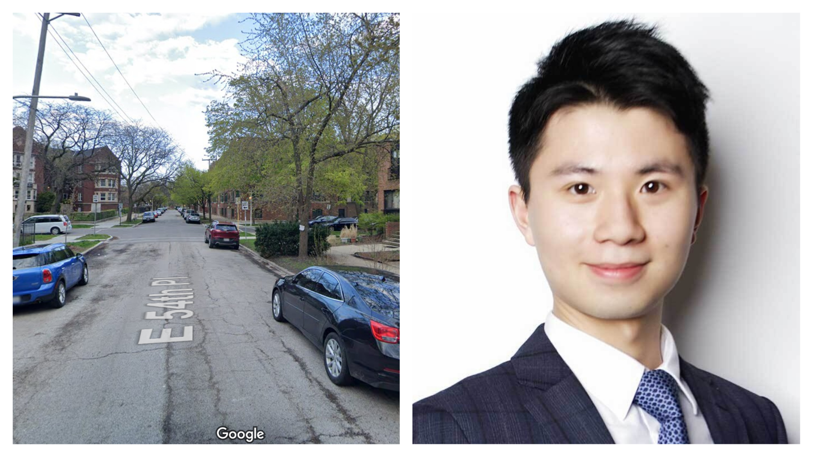

```{r setup, include=FALSE}
knitr::opts_chunk$set(
	echo = TRUE,
	warning = FALSE,
	fig.width = 8, 
  fig.height = 6,
  out.width = "90%"
)
#install.packages("DT")
library(DT)
library(tidyverse)
library(leaflet)
library(lubridate)
library(ggExtra)
library(plotly)
library(maps)
library(mapdata)
library(ggthemes)
library(mapproj)
library(ggthemes)
library(gganimate)
library(viridis)
library(wordcloud)
library(RColorBrewer)
library(tm)
theme_set(theme_minimal() + theme(legend.position = "bottom"))
```

<p align="center">
## **Motivation**

<p align="center">
{width=100% height=60%}  
</p>
<p align=" center", p style="font-family: times, serif; font-size:11pt; font-style:italic">
Photo retrieved from DC Extended Universe Wiki
</p>

  Gotham City, a city of sin that exists in comic and film works, is wildly considered to be created based on New York. This is because from a lexical history perspective, Gotham City is an alias for New York. This alias first appeared in Washington Irving's mocking periodical "Salmagundi" in 1807. Frank Miller, the author of Batman's Dark Knight Revisited, also said, "Metropolis is New York by day; Gotham City is New York by night."
  
  However, the longtimde author of Batman series Neal Adams thought  Gotham City was more like Chicago-based in the early comics. A city that combines prosperity with high crime rates. From the towering skyscrapers to the trash-strewn back alleys. Brilliant neon lights at night  can't hide the darkness beneath the glitz. These characteristics of Chicago set the tone for Gotham City, the shadowy capital of evil.
  
  Due to a shooting case that happened in Chicago recently, the crime rates in different areas of Chicago caught our attention. Violent incidents in Chicago are of increasing concern over the last few years, and we are interested in looking at what might be associated with increased violence in Chicago. We are concerned about people’s living safety in the city and motivated to find safer neighborhoods for living in Chicago.

## **Related work**

<p align="center">
{width=60% height=60%}  </p>
<p align=" center", p style="font-family: times, serif; font-size:11pt; font-style:italic">
An 18-year-old man was charged with robbing and murdering Shaoxiong “Dennis” Zheng (right), 24, in the 900 block of East 54th Place (left) Tuesday afternoon
</p>
  Apart from that, news came that Zheng, a 24-year-old native of of China’s Sichuan province, was shot and killed on November 9th during a robbery in the 900 block of East 54th Place, which was in the vicinity of University of Chicago's campus. As his compatriots, we were all overwhelmed by unbearable sorrow and loss. And such tragedies kept occuring every now and then. Therefore, our concern towards the crimes in Chicago grew.
  News and picture all retrieved from [BlockClubChicago](https://blockclubchicago.org/2021/11/15/man-charged-with-murder-in-killing-of-uchicago-graduate-in-hyde-park/)
 

 
## **Data**

#### **Data Source**

6-year Chicago Crime data records are retrieved from Chicago’s official public data [Chicago Data Portal](https://data.cityofchicago.org). 

* 6-year Chicago crime data records (2016 - 2021):
  - [2016](https://data.cityofchicago.org/Public-Safety/Crimes-2016/kf95-mnd6/data)
  - [2017](https://data.cityofchicago.org/Public-Safety/Crimes-2017/d62x-nvdr/data)
  - [2018](https://data.cityofchicago.org/Public-Safety/Crimes-2018/3i3m-jwuy/data)
  - [2019](https://data.cityofchicago.org/Public-Safety/Crimes-2019/w98m-zvie/data)
  - [2020](https://data.cityofchicago.org/Public-Safety/Crimes-2020/qzdf-xmn8/data)
  - [2021](https://data.cityofchicago.org/Public-Safety/Crimes-2021/dwme-t96c/data)

This dataset reflects reported incidents of crime (with the exception of murders where data exists for each victim) that occurred in the City of Chicago from 2006 to present, minus the most recent seven days. Data is extracted from the Chicago Police Department's CLEAR (Citizen Law Enforcement Analysis and Reporting) system. In order to protect the privacy of crime victims, addresses are shown at the block level only and specific locations are not identified.  Each record represents one criminal case. This dataset contains approximately 2 million crime records and details 22 variables such as ID, number, data, neighborhood, IUCR, and primary type for each case.

#### **Data Processing and Clean**

First we eliminated missisng variables and cleaned the variable names to lower_case names. Then, we tried to filter "arrest" and "domestic" data to select non-domestic closed cases. Since each year's criminal records are contained in a separate dataset respectively, we created a tidy dataframe containing all criminal records from 2017 to 2021. Also, since our analysis will include some predictions for trend, we split variable "data" and composed new variables as "year","month", and "day" respectively to facilitate our analysis of trends for each year. Here is our data process:

```{r roughly data cleaning, eval = FALSE}
# clean data 
crime_2017 =
   read.csv("./data/Crimes_-_2017.csv") %>% 
   drop_na() %>% 
   janitor::clean_names() %>%
   filter(arrest=="true",domestic=="false")
crime_2018 =
   read.csv("./data/Crimes_-_2018.csv") %>% 
   drop_na() %>% 
   janitor::clean_names() %>%
   filter(arrest=="true",domestic=="false")
crime_2019 =
   read.csv("./data/Crimes_-_2019.csv") %>% 
   drop_na() %>% 
   janitor::clean_names() %>%
   filter(arrest=="true",domestic=="false")
crime_2020 =
   read.csv("./data/Crimes_-_2020.csv") %>% 
   drop_na() %>% 
   janitor::clean_names() %>%
   filter(arrest=="true",domestic=="false")
crime_2021 =
   read.csv("./data/Crimes_-_2021.csv") %>% 
   drop_na() %>% 
   janitor::clean_names() %>%
   filter(arrest=="true",domestic=="false")

five_year_data=
   do.call("rbind",list(crime_2017,crime_2018,crime_2019,crime_2020,crime_2021)) %>% 
   mutate(
      date=strptime(date, "%m/%d/%Y %I:%M:%S %p"),
      date=as.Date(date,"%Y-%m-%d"),
      year = as.numeric(format(date, format = "%Y")),
      month = as.numeric(format(date, format = "%m")),
      month=month.abb[month],
      day = as.numeric(format(date, format = "%d"))
      ) %>% 
   relocate(year,month,day,.before = date)
write.csv(full_df,file="./data/five_year_data.csv")
```

The part of resulting data `five_year_data` used for analysis can be viewed below, showing the latest cases.

```{r echo=FALSE}
show_data = read.csv("./data/five_year_data.csv")
datatable(tail(show_data,100), rownames = FALSE, filter = "top", 
          options = list(pageLength = 5, scrollX = T, Width = 100))

```

#### **Data Description**

The resulting data file of `data_clean` contains 45498 criminal records and 24 variables.
The list below is the description of our interested variables:
 
 * `data`. The date of occurrence of crime.
 * `block`. The block where the crime occurred.
 * `primary_type`. The primary description of crime.
 * `description`. Detail description to the crime.
 * `location decription`. Detail description about where the crime occurred.
 * `latitude`. The latitude of occurrence of crime.
 * `longitude`. The longitude of occurrence of crime.

## **Research Questions**

* Question 1: How does the crime amount change over these 6 years? Is there any significant change in the number of crimes? What are the possible reasons that cause the change?

* Question 2: In what kind of location in Chicago does the most amount of crime happen? Which type of crime is most likely to occur in Chicago?

* Question 3: According to the data analysis, what suggestions we can give on the security in Chicago?

## **Main Results**

The range of the number of crimes per year is between 4,629 and 10,824 from 2016 to 2021. The peak number of the crimes over time is in 2020 with 10,824 cases. The crime rate has a significant increase in 2020, and the significant increase of crime in Chicago is probably associated with the COVID-19 prevalence. 

In Chicago, the most amount of crimes happens in apartments, residence, streets and sidewalks.The top three crime types in Chicago in our study are battery, assault, and other offenses, and these crime types are indeed more likely to occur in these locations.Battery means the intentional use of force or violence against another. Thus, people in Chicago need to pay more attention on others’ intentionally physical harm. 

According to the distribution of Crime Rate From 2016 to 2021 in Chicago, the most of crimes is concentrated in the central and south side of this city. Chicago’s persistently high crime rate is inextricably linked to the density of gangs. It is reasonable for us to suspect that the concentration of gangs is one of the reasons for the high level of violence in Chicago. Thus, we would like to suggest people who live in southern Chicago to be beware of the personal safety.

## **Conclusion**


</p>